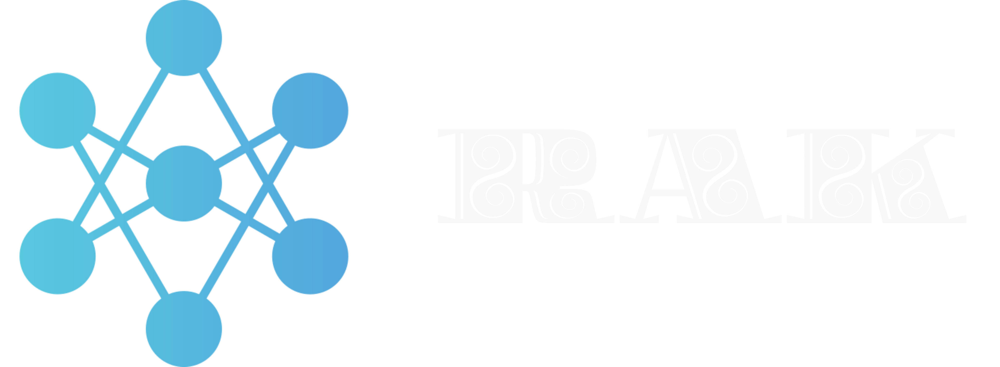

# RAK Project



## Overview
The RAK Project is a web application dedicated to the RAK platform, focusing on penetration testing and vulnerability assessment. It provides users with a comprehensive set of tools for assessing and addressing security vulnerabilities in their systems and infrastructures. The project is built using React, offering a scalable and efficient solution for users.

## Added Features

- Mobile Version: The project now includes a mobile version to enhance user experience on various devices.
- React Implementation: Utilizes React to create a dynamic and interactive user interface.
- JSON Integration: Incorporates JSON for efficient data handling.

## Technologies Used
**Frontend:**
- React: A JavaScript library for building user interfaces.
- React Router: For declarative routing in a React application.
- Axios: A promise-based HTTP client for making requests to the backend API.

**Backend:**
- Node.js: A JavaScript runtime for server-side development.
- Express: A minimal and flexible Node.js web application framework.
- JSON Server: A simple REST API server for rapid development.

## Getting Started
1. **Clone the repository:**
    ```bash
    git clone https://github.com/shadowclan-R/RAK_Net-Scanner_Project.git
    ```

2. **Navigate to the project folder:**
    ```bash
    cd rak-react-project
    ```

3. **Install dependencies:**
    - For frontend:
        ```bash
        cd client && npm install
        ```
    - For backend:
        ```bash
        cd server && npm install
        ```

4. **Start the frontend and backend servers:**
    - Frontend:
        ```bash
        cd client && npm start
        ```
    - Backend:
        ```bash
        cd server && npm start
        ```
